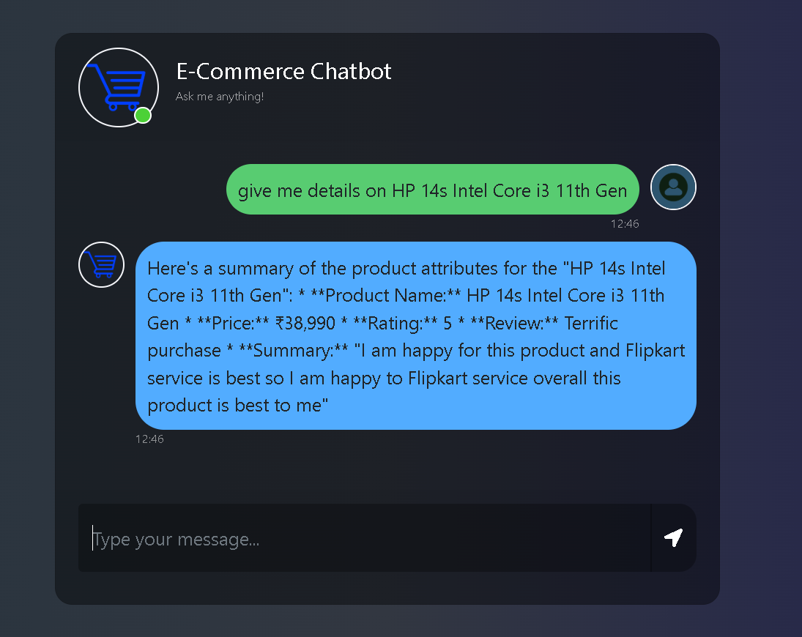
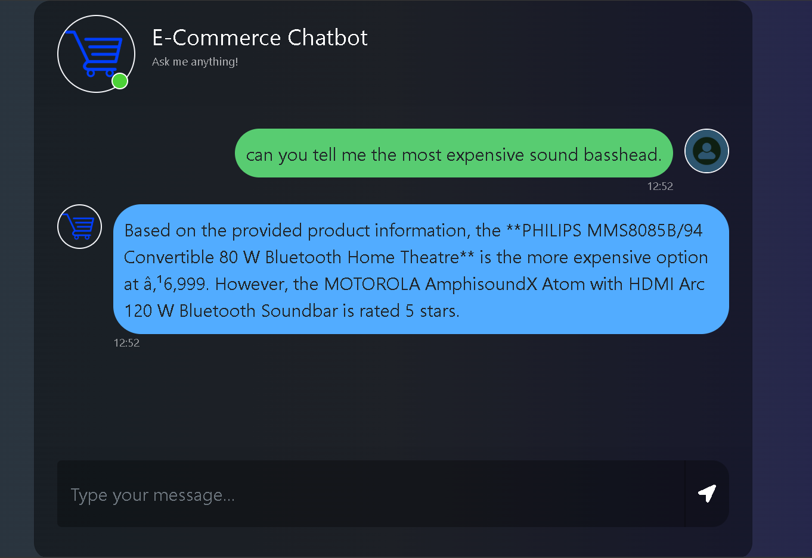

# Ecommerce Chatbot





## Overview
The **Ecommerce Chatbot** is an AI-powered product search assistant that helps users find product details based on their queries. It utilizes **LangChain**, **Google Generative AI Embeddings**, and **AstraDB Vector Store** for efficient retrieval of product data. The chatbot is served through a **Flask web application**.

## Features
- **CSV to Document Conversion**: Converts product data from CSV format into structured documents.
- **Vector Store Ingestion**: Stores product details in an **AstraDB Vector Store** for retrieval.
- **AI-Powered Search**: Uses **Google Generative AI (Gemini)** for natural language understanding.
- **Flask Web Interface**: Provides a user-friendly chat interface to interact with the bot.

## Project Structure
```
EcommerceChatbot/
│── data_converter.py          # Converts CSV data to structured documents
│── ingest.py                  # Ingests data into AstraDB vector store
│── retrieval_generation.py     # Retrieves relevant product details using AI
│── app.py                     # Flask web app to serve the chatbot
│── templates/
│   └── chat.html              # Frontend UI for the chatbot
│── static/
│   └── style.css              # CSS styling (if any)
│── .env                       # Environment variables (API keys, database configs)
│── requirements.txt           # Python dependencies
```

## Installation
### Prerequisites
Ensure you have Python **3.10+** installed on your system.

### Clone the Repository
```sh
git clone https://github.com/PriyanshuDey23/EcomChatBot.git
cd ecommerce-chatbot
```

### Install Dependencies
```sh
pip install -r requirements.txt
```

### Set Up Environment Variables
Create a **.env** file in the root directory and add the following:
```ini
GOOGLE_API_KEY=your_google_api_key
ASTRA_DB_API_ENDPOINT=your_astra_db_endpoint
ASTRA_DB_APPLICATION_TOKEN=your_astra_db_token
ASTRA_DB_KEYSPACE=your_astra_db_keyspace
```

## Usage
### 1. Data Ingestion
Before running the chatbot, you need to ingest product data into the **AstraDB Vector Store**:
```sh
python EcommerceChatbot/ingest.py
```
This will convert the CSV data into documents and store them in the vector database.

### 2. Run the Flask App
Start the chatbot web application:
```sh
python app.py
```
Access the chatbot at **http://127.0.0.1:5000/**

## API Endpoints
| Endpoint      | Method | Description |
|--------------|--------|-------------|
| `/`          | GET    | Loads the chatbot UI |
| `/get`       | POST   | Processes user queries and returns AI-generated responses |


## Technologies Used
- **Python** (Flask, Pandas, OS, dotenv)
- **LangChain** (Document Processing, Vector Search)
- **Google Generative AI (Gemini)** (LLM for product search)
- **AstraDB Vector Store** (Vector Database for efficient retrieval)
- **HTML/CSS** (Frontend UI)

## Future Improvements
- Implement authentication for secure API usage.
- Enhance the UI with **Bootstrap/Tailwind CSS**.
- Deploy on **AWS/GCP** for production use.
- Add multi-language support.

## License
This project is licensed under the **MIT License**.

